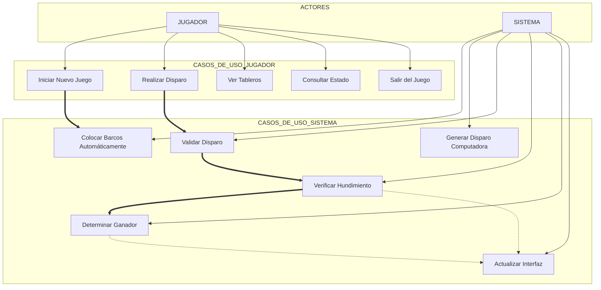
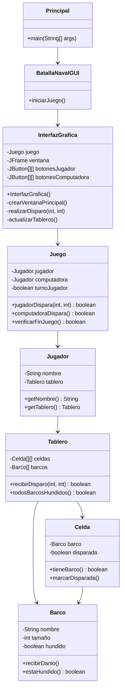
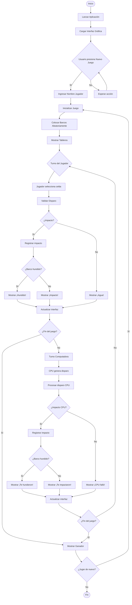
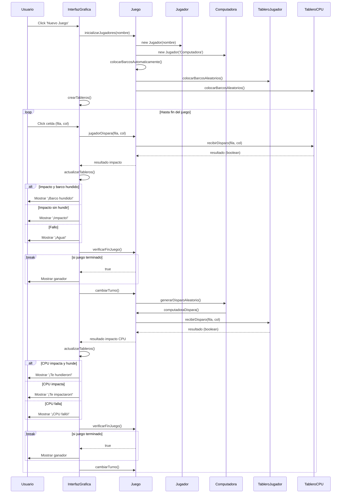

# Batalla Naval En Bolivia

Un juego clásico de Batalla Naval implementado en Java con interfaz gráfica Swing, para poder compreender la progrmacion orientada a objetos.

## Características

- **🎮 Interfaz gráfica intuitiva** - Dos tableros interactivos
- **🤖 IA básica** - Computadora con disparos aleatorios
- **🎯 Sistema de turnos** - Alternancia entre jugador y computadora
- **💥 Detección inteligente** - Impactos, hundimientos y fin del juego
- **🎨 Visualización clara** - Colores y símbolos para cada estado
- **🔄 Reinicio completo** - Nuevas partidas con un clic

## Capturas de Pantalla

## Tecnologías Utilizadas

- Java 20 - Lenguaje de programación
- Swing - Interfaz gráfica de usuario
- Random - Generación de posiciones aleatorias

## Estructura del Proyecto
BatallaNaval/
├── src/
│ ├── Principal.java 
│ ├── BatallaNavalGUI.java 
│ ├── InterfazGrafica.java
│ ├── Juego.java
│ ├── Jugador.java
│ ├── Tablero.java 
│ ├── Barco.java 
│ └── Celda.java
└── README.md

## Cómo Jugar

1. Iniciar juego: Haz clic en "Nuevo Juego"
2. Ingresar nombre: Escribe tu nombre cuando se solicite
3. Disparar: Haz clic en el tablero enemigo para disparar
4. Turnos: Alterna entre tu turno y el de la computadora
5. Objetivo: Hundir todos los barcos enemigos antes de que hundan los tuyos

## Ayuda Visual

| Símbolo | Color           | Descripción |
|---------|-----------------|-------------|
| `▓`     | 🟦 Gris Oscuro  | Tus barcos  |
| `X`     | 🔴 Rojo         | Impacto en barco |
| `Ø`     | 🟠 Naranja      | Barco hundido |
| `•`     | 🔵 Azul         | Disparo al agua |
| `·`     | 🔵 Azul Claro   | Océano/Agua |

# Instalación y Ejecución

## MANUAL DE USUARIO
Instalación: 

Requisitos del Sistema
Java Runtime Environment (JRE) 8 o superior

500 MB de espacio libre

Resolución mínima 1024x768

Pasos de Instalación

1. Descargar los archivos del proyecto
2. Abrir terminal en la carpeta del proyecto
3. Compilar: javac *.java
4. Ejecutar: java BatallaNaval

## Guía de Uso

1.Inicio del Juego
2.Ejecutar la aplicación
3.Hacer clic en "Nuevo Juego"
4.Ingresar nombre cuando se solicite
5.Los barcos se colocan automáticamente

Durante el Juego

1.Tu turno: Haz clic en el tablero enemigo (derecho)
2.Turno PC: Espera a que la computadora dispare

Símbolos:

▓ = Tus barcos

X = Impacto

Ø = Barco hundido

• = Agua

### Fin del Juego

1.Victoria: Hundes todos los barcos enemigos
2.Derrota: La PC hunde todos tus barcos
3.Reinicio: Botón "Nuevo Juego"

## 3. DIAGRAMAS UML

### 3.1 Diagrama de Casos de Uso:

### Explicación del Diagrama:

1. Este diagrama muestra las interacciones entre el jugador y el sistema, identificando todas las funcionalidades principales que puede realizar cada actor durante el juego.

### Relaciones Principales:

1. Jugador → Sistema: El jugador inicia acciones y el sistema responde.
2. Inclusión (==>): Al iniciar juego se incluye colocar barcos, al disparar se incluye validación.
3.Extensión (-.->): La actualización de interfaz se extiende desde hundimiento y determinación de ganador.

### Características Claves:

1. 7 casos de uso del jugador que definen la experiencia de usuario
2. 6 casos de uso del sistema que gestionan la lógica del juego
3. Sistema de turnos automático gestionado internamente
4. Validación en tiempo real de todas las acciones del jugador

### 3.2 Diagrama de Clases:

### Explicación del Diagrama:
 1. Representa la estructura estática del sistema mostrando las clases, sus atributos, métodos y las relaciones entre ellas. Es el blueprint de toda la aplicación.

### Relaciones Principales:

1. Composición (◆): Tablero compuesto de Celdas y Barcos.
2. Agregación (◇): Juego agrega Jugadores.
3. Dependencia (→): InterfazGrafica depende de Juego para la lógica.
4. Navegabilidad: Flujo claro desde Principal hasta las entidades base.

### Características Claves:

1. Arquitectura MVC implícita: InterfazGrafica (Vista), Juego (Controlador), Entidades (Modelo).
2. Encapsulamiento robusto: Atributos privados con getters públicos.
3. Cohesión alta: Cada clase tiene responsabilidades bien definidas.
4. Bajo acoplamiento: Las clases se comunican através de interfaces claras.

### 3.3 Diagrama de Actividades:

### Explicación del Diagrama:

1. Describe el flujo de trabajo completo del juego, desde el inicio hasta el final, mostrando todas las decisiones, procesos y alternativas que ocurren durante la partida.

### Relaciones Principales:

1. Secuencia lineal: Flujo principal de izquierda a derecha.
2. Bifurcaciones (rombo): Decisiones que alteran el flujo (impacto/agua, hundimiento, fin de juego).
3. Bucles cíclicos: Turnos que se repiten hasta fin del juego.
4. Concurrencia: Procesos paralelos para jugador y CPU.

### Características Claves:

1. Flujo de turnos bien definido: Jugador → Validación → CPU → Repeat.
2. Manejo de errores: Validación de celdas ya disparadas.
3. Estados de resultado claros: Impacto, Agua, Hundido.
4 .Recursividad: Posibilidad de jugar múltiples partidas.

### Diagrama de Secuencia

### Explicación del Diagrama:

1. Muestra la secuencia temporal de mensajes entre objetos durante una partida completa, detallando las interacciones en el orden exacto en que ocurren.

### Relaciones Principales:

1. Mensajes síncronos (->>): Llamadas que esperan respuesta
2. Mensajes asíncronos (--): Notificaciones sin espera
3. Fragmentos alt: Alternativas condicionales (impacto/agua/hundido)
4. Bucles loop: Ciclo principal de turnos
5. Break: Condiciones de salida del bucle

### Características Claves:

1. Comunicación en tiempo real entre todos los componentes.
2. Patrón observador: InterfazGrafica observa cambios en Juego.
3. Validación bidireccional: Confirmaciones en cada paso.
4. Manejo de estados: Transiciones claras entre estados del juego.

