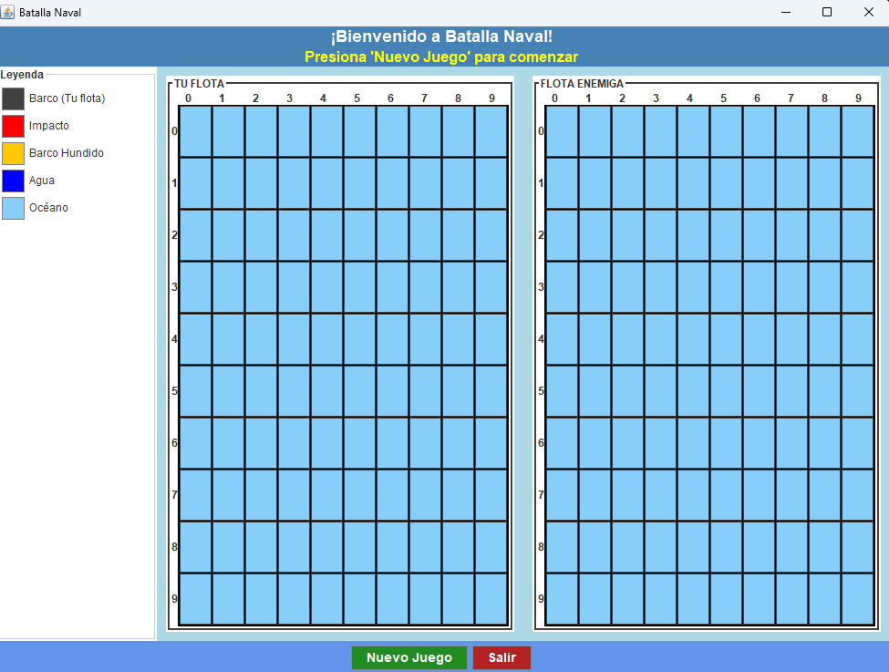

# 🎯 Batalla Naval - Java

Un juego clásico de Batalla Naval implementado en Java con interfaz gráfica Swing, perfecto para estudiantes de programación.

## 🚀 Características

- **🎮 Interfaz gráfica intuitiva** - Dos tableros interactivos
- **🤖 IA básica** - Computadora con disparos aleatorios
- **🎯 Sistema de turnos** - Alternancia entre jugador y computadora
- **💥 Detección inteligente** - Impactos, hundimientos y fin del juego
- **🎨 Visualización clara** - Colores y símbolos para cada estado
- **🔄 Reinicio completo** - Nuevas partidas con un clic

## 📸 Capturas de Pantalla

## 🛠️ Tecnologías Utilizadas

- **Java 17** - Lenguaje de programación
- **Swing** - Interfaz gráfica de usuario
- **AWT** - Manipulación de eventos y gráficos
- **Random** - Generación de posiciones aleatorias

## 📦 Estructura del Proyecto
BatallaNaval/
├── src/
│ ├── BatallaNaval.java # Clase principal
│ ├── InterfazGrafica.java # Interfaz gráfica
│ ├── Juego.java # Lógica del juego
│ ├── Jugador.java # Modelo de jugador
│ ├── Tablero.java # Gestión del tablero
│ ├── Barco.java # Modelo de barco
│ └── Celda.java # Modelo de celda
├── docs/
│ └── Documentacion.pdf # Documentación completa
└── README.md

## 🎯 Cómo Jugar

1. **Iniciar juego**: Haz clic en "Nuevo Juego"
2. **Ingresar nombre**: Escribe tu nombre cuando se solicite
3. **Colocación**: Los barcos se colocan automáticamente
4. **Disparar**: Haz clic en el tablero enemigo para disparar
5. **Turnos**: Alterna entre tu turno y el de la computadora
6. **Objetivo**: Hundir todos los barcos enemigos antes de que hundan los tuyos

## 🎨 Leyenda Visual

| Símbolo | Color | Descripción |
|---------|-------|-------------|
| `▓`     | 🟦 Gris Oscuro | Tus barcos |
| `X`     | 🔴 Rojo | Impacto en barco |
| `Ø`     | 🟠 Naranja | Barco hundido |
| `•`     | 🔵 Azul | Disparo al agua |
| `·`     | 🔵 Azul Claro | Océano/Agua |

## ⚙️ Instalación y Ejecución

2. MANUAL DE USUARIO
6.1 Instalación
Requisitos del Sistema
Java Runtime Environment (JRE) 8 o superior

500 MB de espacio libre

Resolución mínima 1024x768

Pasos de Instalación
Descargar los archivos del proyecto

Abrir terminal en la carpeta del proyecto

Compilar: javac *.java

Ejecutar: java BatallaNaval

6.2 Guía de Uso
Inicio del Juego
Ejecutar la aplicación

Hacer clic en "Nuevo Juego"

Ingresar nombre cuando se solicite

Los barcos se colocan automáticamente

Durante el Juego
Tu turno: Haz clic en el tablero enemigo (derecho)

Turno PC: Espera a que la computadora dispare

Símbolos:

▓ = Tus barcos

X = Impacto

Ø = Barco hundido

• = Agua

Fin del Juego
Victoria: Hundes todos los barcos enemigos

Derrota: La PC hunde todos tus barcos

Reinicio: Botón "Nuevo Juego"

3. DIAGRAMAS UML

3.1 Diagrama de Clases

3.2 Diagrama de Secuencia - Realizar Disparo

sequenceDiagram
    participant U as Usuario
    participant IG as InterfazGrafica
    participant J as Juego
    participant T as Tablero
    participant C as Celda
    participant B as Barco
    
 U->>IG: Clic en coordenada (x,y)
    IG->>J: jugadorDispara(x,y)
    J->>T: recibirDisparo(x,y)
    T->>C: marcarDisparada()
    C->>C: verificar si tiene barco
    alt Tiene barco
        C->>B: recibirDanio()
        B->>B: incrementar daño
        B-->>C: verificar si hundido
        C-->>T: return true (impacto)
    else No tiene barco
        C-->>T: return false (agua)
    end
    T-->>J: resultado disparo
    J-->>IG: impacto/agua
    IG->>IG: actualizar interfaz
    IG-->>U: mostrar resultado

3.3 Diagrama de Estados - Barco    
    stateDiagram-v2
    [*] --> Intacto
    Intacto --> Impactado: recibirDanio()
    Impactado --> Intacto: (no aplica)
    Impactado --> Hundido: danioRecibido >= tamaño
    Hundido --> [*]

3.4 Diagrama de Casos de Uso

usecaseDiagram
    title Casos de Uso - Batalla Naval
    
actor Jugador as "Jugador"
    actor Sistema as "Sistema"
    
Jugador --> (Iniciar Juego)
    Jugador --> (Realizar Disparo)
    Jugador --> (Ver Tablero)
    Jugador --> (Reiniciar Juego)
    
 Sistema --> (Colocar Barcos)
    Sistema --> (Generar Disparo PC)
    Sistema --> (Verificar Fin Juego)
    Sistema --> (Mostrar Resultados)
    
(Realizar Disparo) .> (Verificar Impacto) : include
    (Verificar Impacto) .> (Verificar Hundimiento) : include

4. ARQUITECTURA DEL SISTEMA
4.1 Patrón MVC Aplicado

┌─────────────────┐    ┌─────────────────┐    ┌─────────────────┐
│      VISTA      │    │   CONTROLADOR   │    │     MODELO      │
│                 │    │                 │    │                 │
│ InterfazGrafica │◄──►│     Juego       │◄──►│ Jugador         │
│ - Botones       │    │ - Lógica turnos │    │ - Tablero       │
│ - Labels        │    │ - Validaciones  │    │ - Barco         │
│ - Paneles       │    │ - Coordinación  │    │ - Celda         │
└─────────────────┘    └─────────────────┘    └─────────────────┘

4.2 Flujo de Datos

1.Entrada: Usuario hace clic en interfaz

2.Procesamiento: Controlador valida y ejecuta lógica

3.Actualización: Modelo cambia su estado

4.Salida: Vista se actualiza con nuevos datos

4.3 Estructura de Paquetes

batalla.naval/
├── controlador/
│   └── Juego.java
├── modelo/
│   ├── Jugador.java
│   ├── Tablero.java
│   ├── Barco.java
│   └── Celda.java
├── vista/
│   └── InterfazGrafica.java
└── principal/
    └── Principal.java
